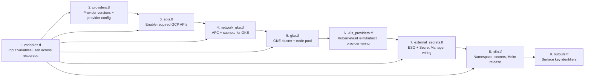

# Repository Guidelines

## Project Structure & Module Organization
- Terraform configuration lives in the `n8n/` directory (`*.tf`).
- Networking and GKE provisioning: `network_gke.tf`, `gke.tf`, `apis.tf`.
- Cloud SQL (Postgres) provisioning: `cloudsql.tf`.
- External Secrets + Workload Identity wiring: `external_secrets.tf`.
- n8n deployment and Kubernetes/Helm resources: `n8n.tf`, `k8s_providers.tf`.
- Inputs and outputs: `variables.tf`, `outputs.tf`, provider versions in `providers.tf`.

## Provider Configuration
The project uses four Terraform providers:

| Provider | Source | Purpose |
|----------|--------|---------|
| google | hashicorp/google | GCP resources (VPC, GKE, Cloud SQL, IAM) |
| kubernetes | hashicorp/kubernetes | K8s namespace, service accounts |
| helm | hashicorp/helm | n8n Helm chart deployment |
| kubectl | gavinbunney/kubectl | CRDs (SecretStore, ExternalSecret) |

**Note**: The `kubectl` provider is used for Custom Resource Definitions because it handles the "chicken-and-egg" problem where CRDs need to be planned before the GKE cluster exists.

## Process Diagram (File Responsibilities & Sequence)


### File Descriptions
1. `variables.tf`: Central inputs used by all other files.
2. `providers.tf`: Pins provider versions (google, kubernetes, helm, kubectl) and sets provider config.
3. `apis.tf`: Enables GCP APIs required before networking/cluster creation.
4. `network_gke.tf`: Provisions VPC (`n8n-network`) and subnets consumed by the GKE cluster.
5. `gke.tf`: Creates the GKE cluster and node pool with Workload Identity enabled.
6. `k8s_providers.tf`: Configures Kubernetes/Helm/kubectl providers to point at GKE dynamically.
7. `external_secrets.tf`: Configures External Secrets + Secret Manager access via Workload Identity using `kubectl_manifest`.
8. `n8n.tf`: Creates namespace and deploys n8n via Helm (secrets supplied by ESO).
9. `outputs.tf`: Exposes identifiers after apply for quick reference.

## Build, Test, and Development Commands
- `terraform init`: Installs providers and initializes state.
- `terraform init -upgrade`: Upgrades providers to latest compatible versions.
- `terraform fmt -recursive`: Formats all `.tf` files.
- `terraform validate`: Checks configuration syntax and types.
- `terraform plan -out tfplan`: Previews changes before apply.
- `terraform apply tfplan`: Creates/updates GKE + n8n resources.
- `terraform destroy`: Tears down all resources created by this config.

## Deployment Steps (Required Vars)

### Pre-requisites
Create secrets in GCP Secret Manager before running Terraform:
```sh
# Encryption key
echo -n "$(openssl rand -hex 32)" | gcloud secrets create n8n-encryption-key \
  --data-file=- --project=YOUR_PROJECT_ID

# Database password
echo -n "your-secure-password" | gcloud secrets create n8n-db-password \
  --data-file=- --project=YOUR_PROJECT_ID
```

### Deploy
```sh
export TF_VAR_n8n_encryption_key_secret_name="n8n-encryption-key"
export TF_VAR_n8n_db_password_secret_name="n8n-db-password"

terrafrom init

terraform apply \
  -var="project_id=YOUR_PROJECT_ID" \
  -var="region=europe-north1" \
  -var="zone=europe-north1-a" \
  -var="network_name=n8n-network" \
  -var="cluster_name=n8n-gke" \
  -var="n8n_db_user=n8n" \
  -var="cloudsql_instance_name=n8n-postgres" \
  -var="cloudsql_database_name=n8n" \
  -var="external_secrets_gcp_sa_name=n8n-external-secrets"
```

### Post-deployment: Install External Secrets Operator
```sh
gcloud container clusters get-credentials n8n-gke --zone europe-north1-a

kubectl apply --server-side -f https://github.com/external-secrets/external-secrets/releases/download/v0.12.1/external-secrets.yaml
```

### Create Database User
```sh
gcloud sql users create n8n \
  --instance=n8n-postgres \
  --password="your-secure-password" \
  --project=YOUR_PROJECT_ID
```

## Coding Style & Naming Conventions
- Use standard Terraform style: 2-space indentation, snake_case for variables.
- Keep resources grouped by concern (APIs, network, cluster, app).
- Prefer explicit versions for providers and Helm chart (`providers.tf`, `n8n_chart_version`).
- Use `kubectl_manifest` for CRDs to handle plan-time cluster unavailability.
- Add `depends_on` explicitly when implicit dependencies aren't sufficient.

## Testing Guidelines
- No automated tests are defined in this repository.
- Use `terraform validate` and a `terraform plan` review as the primary checks.
- Verify provider versions in `.terraform.lock.hcl` after `terraform init`.

## Commit & Pull Request Guidelines
- Use short, imperative commit messages (e.g., "Add n8n ingress host input").
- PRs should include: summary of changes, `terraform plan` output, and any new variables or outputs added.

## Security & Configuration Notes
- Secrets are stored in Secret Manager and materialized in-cluster by External Secrets; Terraform state does not include secret payloads.
- External Secrets Operator must be installed in the cluster after GKE is created.
- Cloud SQL uses private IP via Private Service Access.
- The n8n deployment uses its own VPC (`n8n-network`) separate from other workloads.
- Workload Identity binding requires the GKE cluster to exist first (enforced via `depends_on`).

## Key Dependencies
- `google_service_account_iam_member.external_secrets_wi` depends on `google_container_cluster.gke` for Workload Identity pool.
- `kubectl_manifest` resources depend on `kubernetes_service_account_v1.external_secrets`.
- `helm_release.n8n` depends on `kubectl_manifest.n8n_keys` and `kubectl_manifest.n8n_db`.
