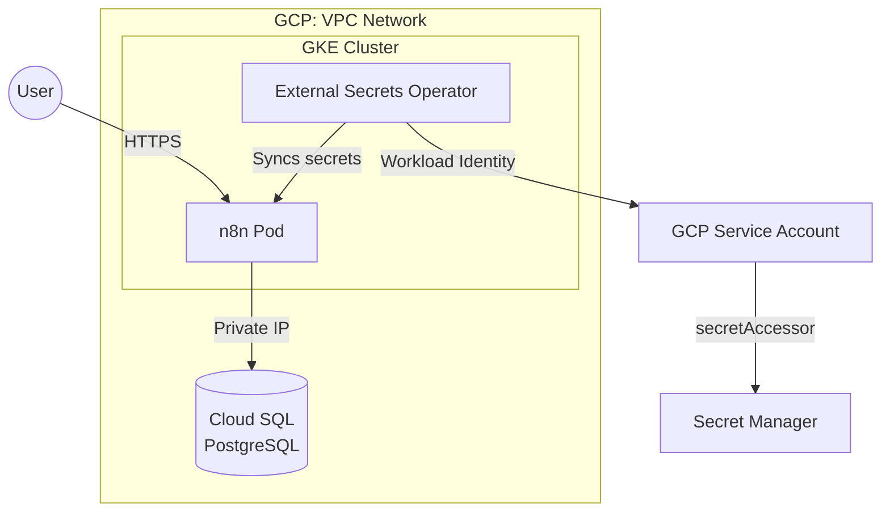

# n8n on GKE - Terraform Configuration

Deploy [n8n](https://n8n.io/) workflow automation on Google Kubernetes Engine with Cloud SQL PostgreSQL and secure secrets management.

## Documentation

- **[DEPLOYMENT.md](DEPLOYMENT.md)** - Complete multi-environment deployment guide
- **[environments/README.md](environments/README.md)** - Environment configuration details
- **[../CLAUDE.md](../CLAUDE.md)** - Technical architecture and patterns reference

## Architecture



**Key components:**
- **GKE cluster** with Workload Identity
- **Cloud SQL** with private IP (no public access)
- **External Secrets Operator** syncs from Secret Manager
- **n8n** deployed via Helm chart
- **GCE Ingress** with Google-managed TLS certificate (managed via `kubectl_manifest`, not Helm)

## Quick Start

### Prerequisites

```bash
# Authenticate and install tools
gcloud auth application-default login
gcloud components install gke-gcloud-auth-plugin
```

### Deploy (Single Environment)

```bash
# 1. Create secrets in Secret Manager
echo -n "$(openssl rand -hex 32)" | gcloud secrets create n8n-encryption-key \
  --data-file=- --project=YOUR_PROJECT_ID

echo -n "placeholder" | gcloud secrets create n8n-db-password \
  --data-file=- --project=YOUR_PROJECT_ID

# 2. Initialize and deploy
cd n8n/
terraform init

terraform apply \
  -var="project_id=YOUR_PROJECT_ID" \
  -var="region=europe-north1" \
  -var="zone=europe-north1-a" \
  -var="network_name=n8n-network" \
  -var="cluster_name=n8n-gke" \
  -var="n8n_db_user=n8n" \
  -var="cloudsql_instance_name=n8n-postgres" \
  -var="cloudsql_database_name=n8n" \
  -var="external_secrets_gcp_sa_name=n8n-external-secrets" \
  -var="n8n_encryption_key_secret_name=n8n-encryption-key" \
  -var="n8n_db_password_secret_name=n8n-db-password"

# 3. Get credentials and access n8n
gcloud container clusters get-credentials n8n-gke --zone europe-north1-a
kubectl get svc -n n8n
# Access at http://<EXTERNAL-IP>:5678
```

**Deployment time:** ~10 minutes

> **Multi-environment deployment?** See [DEPLOYMENT.md](DEPLOYMENT.md) for deploying to dev/staging/production with workspaces and GCS backend.

## Multi-Environment Setup

For production use, deploy across isolated environments:

```
yesgaming-nonprod (project)
├── dev     → https://n8n-dev.theyes.cloud   → gs://yesgaming-tfstate-dev/n8n/
└── staging → https://n8n-stage.theyes.cloud → gs://yesgaming-tfstate-staging/n8n/

boxwood-coil-484213-r6 (project)
└── prod    → https://n8n.theyes.cloud       → gs://yesgaming-tfstate-production/n8n/
```

**Key differences per environment:**

| Environment | Domain | Nodes | SQL Tier | CIDR |
|-------------|--------|-------|----------|------|
| dev | `n8n-dev.theyes.cloud` | 1 × e2-standard-2 | db-f1-micro | 10.10.0.0/16 |
| staging | `n8n-stage.theyes.cloud` | 1 × e2-standard-2 | db-custom-2-7680 | 10.20.0.0/16 |
| production | `n8n.theyes.cloud` | 2 × e2-standard-4 | db-custom-4-15360 | 10.30.0.0/16 |

**Deploy to environment:**
```bash
terraform workspace new dev
terraform init -backend-config="bucket=yesgaming-tfstate-dev"
terraform apply -var-file=environments/dev.tfvars
```

See [DEPLOYMENT.md](DEPLOYMENT.md) for complete setup guide.

## Secrets Management

**Automated flow (zero secrets in Terraform state):**

1. **You create** encryption key in Secret Manager (manual)
2. **Terraform generates** random DB password (32 chars)
3. **Terraform stores** password in Secret Manager
4. **ESO syncs** secrets from Secret Manager → K8s secrets
5. **n8n reads** secrets as environment variables

**Workload Identity:** GCP Service Account ↔ K8s Service Account binding (no keys required)

## Key Features

- ✅ **Multi-environment support** - dev/staging/production with Terraform workspaces
- ✅ **GCS state backend** - Separate bucket per environment
- ✅ **Auto-generated passwords** - Secure random DB passwords managed by Terraform
- ✅ **Private networking** - Cloud SQL accessible via private IP only
- ✅ **Workload Identity** - No service account key files
- ✅ **External Secrets Operator** - Secrets synced from Secret Manager (1h refresh)
- ✅ **Dynamic resource naming** - `{org}-n8n-{env}-{resource}` pattern
- ✅ **HTTPS with Google-managed certificates** - Automatic TLS via GCE Ingress + ManagedCertificate

## File Organization

| File | Purpose |
|------|---------|
| `providers.tf` | Provider versions + GCS backend config |
| `variables.tf` | Input variables + dynamic locals |
| `environments/*.tfvars` | Per-environment configuration |
| `apis.tf` | GCP API enablement |
| `network_gke.tf` | VPC + Private Service Access |
| `gke.tf` | GKE cluster + node pools |
| `cloudsql.tf` | PostgreSQL + auto-generated password |
| `k8s_providers.tf` | Kubernetes provider authentication |
| `external_secrets.tf` | ESO + Workload Identity + CRDs |
| `n8n.tf` | n8n Helm deployment + GCE Ingress + ManagedCertificate |
| `outputs.tf` | Cluster/DB metadata |

## Troubleshooting

### n8n Pod Not Starting

```bash
# Check pod status
kubectl get pods -n n8n

# View logs
kubectl logs -n n8n -l app.kubernetes.io/name=n8n --tail=50

# Check events
kubectl describe pod -n n8n -l app.kubernetes.io/name=n8n
```

**Common causes:**
- Database authentication failed → Check Cloud SQL user exists
- Missing secrets → Check ExternalSecrets synced
- Wrong DB password → Verify password in Secret Manager

### ExternalSecret Not Syncing

```bash
# Check status
kubectl get externalsecret -n n8n
kubectl describe externalsecret n8n-keys -n n8n

# Check ESO logs
kubectl logs -n n8n -l app.kubernetes.io/name=external-secrets

# Verify Workload Identity
kubectl get sa external-secrets -n n8n -o yaml | grep iam.gke.io
```

**Fix:** Wait 60s after IAM binding for propagation (handled by `time_sleep.wait_for_wi`)

### Ingress Has No External IP / SSL Errors

```bash
NAMESPACE=$(terraform output -raw namespace)

# Check ingress status (ADDRESS should have an IP after 2-5 min)
kubectl get ingress -n $NAMESPACE

# Check ManagedCertificate (should be "Active" after DNS setup)
kubectl get managedcertificate -n $NAMESPACE

# Verify DNS resolves to ingress IP (not Cloudflare proxy IPs)
dig +short n8n-dev.theyes.cloud
```

**Common causes:**
- Cloudflare proxy enabled (orange cloud) → Switch to **DNS-only (gray cloud)**
- Cloudflare port rewrite origin rule → Remove it (GCE LB handles port routing)
- ManagedCertificate stuck in "Provisioning" → Verify DNS-only mode, wait 10-15 min

See [DEPLOYMENT.md](DEPLOYMENT.md#dns-and-tls-setup-cloudflare) for detailed Cloudflare configuration.

### kubectl Plugin Error

```bash
# Error: "executable gke-gcloud-auth-plugin not found"
gcloud components install gke-gcloud-auth-plugin
gcloud container clusters get-credentials n8n-gke --zone europe-north1-a
```

### Database Authentication Error

```bash
# Check if Cloud SQL user exists
gcloud sql users list --instance=n8n-postgres --project=YOUR_PROJECT_ID

# If missing, re-run terraform apply
terraform apply
```

### Verify Deployment

```bash
NAMESPACE=$(terraform output -raw namespace)

# Check all components
kubectl get pods,svc,ingress,externalsecret,secretstore -n $NAMESPACE

# Check managed certificate status (should be "Active")
kubectl get managedcertificate -n $NAMESPACE
```

See [CLAUDE.md](../CLAUDE.md#troubleshooting) for detailed troubleshooting guide.

## Configuration Reference

### Required Variables (No Defaults)

| Variable | Description |
|----------|-------------|
| `project_id` | GCP project ID |
| `environment` | Environment name (dev/staging/production) |
| `region` | GCP region |
| `zone` | GCP zone |
| `subnet_cidr` | Primary subnet CIDR |
| `pods_cidr` | Secondary range for pods |
| `services_cidr` | Secondary range for services |
| `network_name` | VPC network name |
| `cluster_name` | GKE cluster name |
| `cloudsql_instance_name` | Cloud SQL instance name |
| `cloudsql_database_name` | Database name |
| `n8n_db_user` | Database user |
| `external_secrets_gcp_sa_name` | GCP SA for External Secrets |
| `n8n_encryption_key_secret_name` | Secret Manager secret for encryption key |
| `n8n_db_password_secret_name` | Secret Manager secret for DB password |

### Optional Variables

| Variable | Default | Description |
|----------|---------|-------------|
| `org_prefix` | `""` | Organization prefix for naming |
| `namespace` | `""` | K8s namespace (defaults to `n8n-{environment}`) |
| `node_machine_type` | `e2-standard-4` | GKE node machine type |
| `node_count` | `2` | Number of GKE nodes |
| `cloudsql_tier` | `db-custom-2-7680` | Cloud SQL tier |
| `cloudsql_disk_size_gb` | `50` | Cloud SQL disk size |
| `cloudsql_deletion_protection` | `false` | Protect instance from deletion |
| `n8n_host` | `""` | Ingress hostname (empty = LoadBalancer) |
| `n8n_chart_version` | `1.16.25` | Helm chart version |

See [environments/README.md](environments/README.md) for environment-specific configurations.

## Security

- **Zero secrets in state:** All sensitive values in Secret Manager
- **Private networking:** Cloud SQL private IP only (no public access)
- **Workload Identity:** GCP ↔ K8s authentication without keys
- **Least privilege IAM:** Service account has only `secretAccessor` role
- **Isolated VPC:** Dedicated network per environment

## Outputs

| Output | Description |
|--------|-------------|
| `project_id` | GCP project ID |
| `environment` | Environment name |
| `workspace` | Terraform workspace |
| `region` | Deployment region |
| `zone` | Deployment zone |
| `vpc_network_name` | VPC network name |
| `cluster_name` | GKE cluster name |
| `namespace` | Kubernetes namespace |
| `cloudsql_instance_name` | Cloud SQL instance name |
| `cloudsql_private_ip` | Cloud SQL private IP |
| `cloudsql_database` | Database name |
| `n8n_db_password` | Database password (sensitive) |

## Common Commands

```bash
# Format and validate
terraform fmt -recursive
terraform validate

# Plan and apply
terraform plan -var-file=environments/dev.tfvars -out=tfplan-dev
terraform apply tfplan-dev

# Get cluster credentials
gcloud container clusters get-credentials $(terraform output -raw cluster_name) \
  --zone $(terraform output -raw zone) --project $(terraform output -raw project_id)

# Check deployment
kubectl get pods -n $(terraform output -raw namespace)
kubectl logs -n $(terraform output -raw namespace) -l app.kubernetes.io/name=n8n

# Get n8n URL
kubectl get svc -n $(terraform output -raw namespace)

# Destroy (careful!)
terraform destroy -var-file=environments/dev.tfvars
```

## Related Documentation

- **[Root README](../README.md)** - Repository overview and quick links
- **[DEPLOYMENT.md](DEPLOYMENT.md)** - Complete multi-environment deployment guide
- **[environments/README.md](environments/README.md)** - Environment configuration details
- **[CLAUDE.md](../CLAUDE.md)** - Technical architecture, patterns, and troubleshooting reference

## Support

For detailed help:
- **Architecture questions:** [CLAUDE.md](../CLAUDE.md)
- **Deployment guide:** [DEPLOYMENT.md](DEPLOYMENT.md)
- **Troubleshooting:** [CLAUDE.md - Troubleshooting](../CLAUDE.md#troubleshooting)
