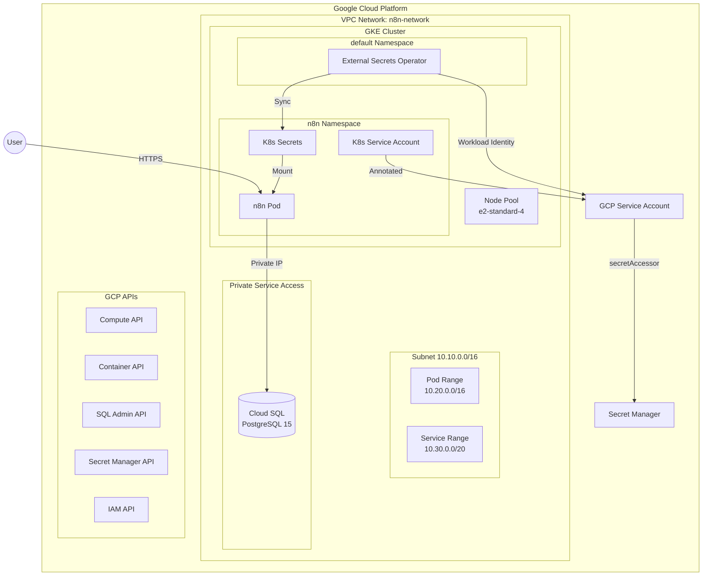
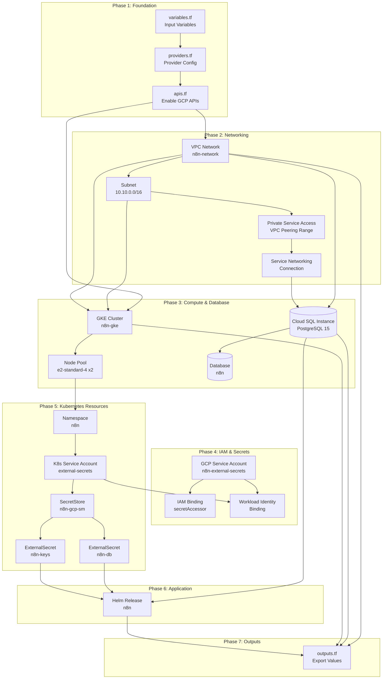
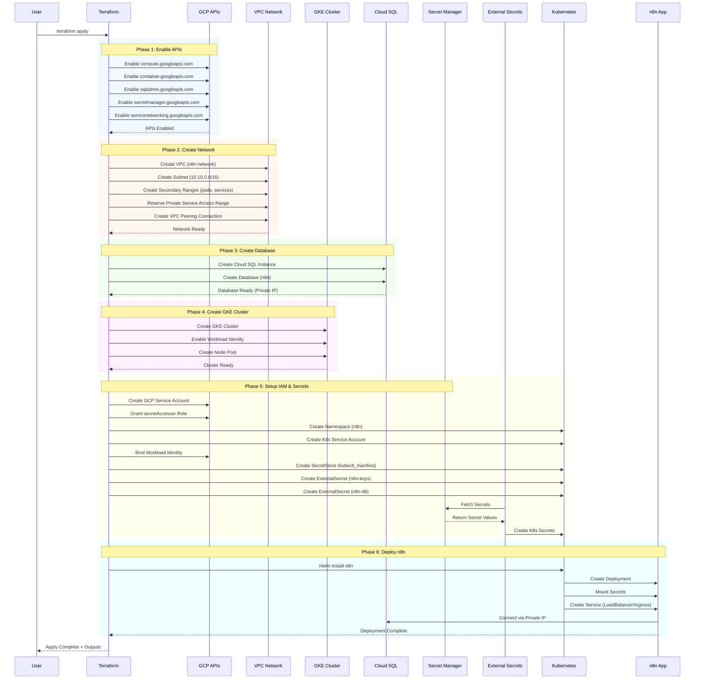
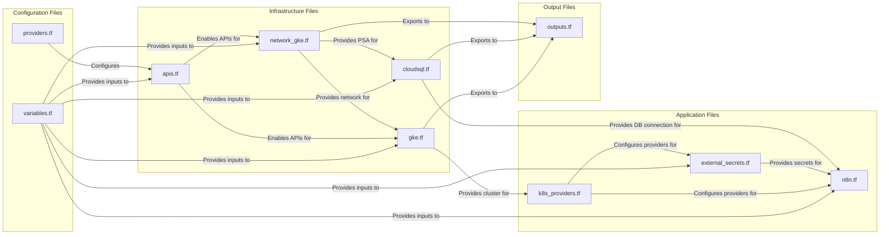
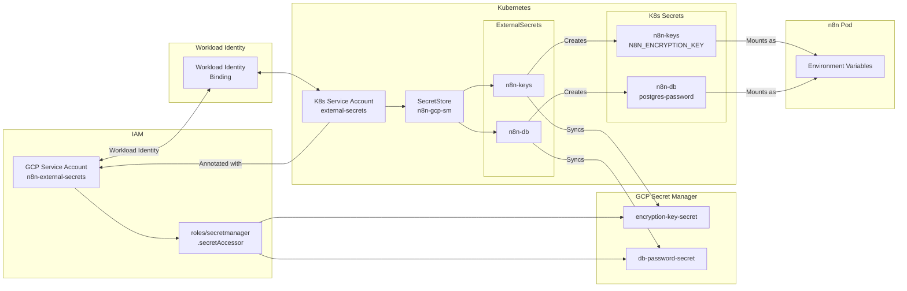
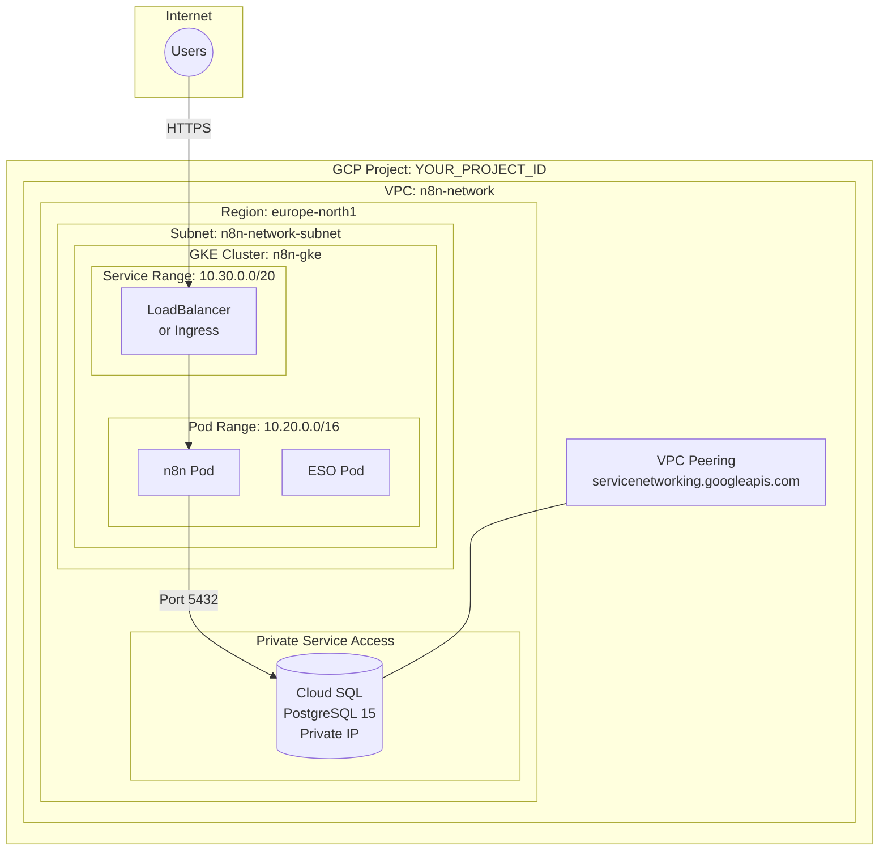

# n8n on GKE - Terraform Configuration

This Terraform configuration deploys [n8n](https://n8n.io/) workflow automation platform on Google Kubernetes Engine (GKE) with Cloud SQL PostgreSQL backend and secure secrets management via External Secrets Operator.

## Architecture Overview



## Terraform Resource Workflow

This diagram shows the dependency chain and execution order of Terraform resources:



## Process Flow Diagram

Step-by-step deployment process showing what happens when you run `terraform apply`:



## File Responsibilities



## Secrets Flow Diagram

How secrets are securely managed from GCP Secret Manager to n8n:



## Network Architecture



## Quick Start

### Prerequisites

1. GCP project with billing enabled
2. `gcloud` CLI authenticated (`gcloud auth application-default login`)
3. Terraform >= 1.5.0
4. kubectl installed
5. `gke-gcloud-auth-plugin` installed (run: `gcloud components install gke-gcloud-auth-plugin`)

### Step 1: Create Encryption Key Secret

**Before running Terraform**, create the n8n encryption key secret:

```bash
# Generate and store the n8n encryption key
echo -n "$(openssl rand -hex 32)" | gcloud secrets create n8n-encryption-key \
  --data-file=- --project=YOUR_PROJECT_ID
```

> [!NOTE]
> The database password is **automatically generated** by Terraform using a secure random password generator and stored in Secret Manager. You don't need to create it manually.

### Step 2: Create Database Password Secret Placeholder

**Before running Terraform**, create an empty secret for the database password:

```bash
# Create empty secret (Terraform will populate it with a random password)
echo -n "placeholder" | gcloud secrets create n8n-db-password \
  --data-file=- --project=YOUR_PROJECT_ID
```

> [!IMPORTANT]
> This placeholder will be **automatically replaced** by Terraform with a secure 32-character random password.

### Step 3: Deploy Complete Infrastructure

**Single-step deployment** - Terraform will automatically:
- Create GKE cluster and Cloud SQL instance
- Generate a secure random database password
- Create the database user with the generated password
- Store the password in Secret Manager
- Deploy External Secrets Operator
- Deploy n8n application

```bash
cd n8n/
terraform init

terraform apply \
  -var="project_id=YOUR_PROJECT_ID" \
  -var="region=europe-north1" \
  -var="zone=europe-north1-a" \
  -var="network_name=n8n-network" \
  -var="cluster_name=n8n-gke" \
  -var="n8n_db_user=n8n" \
  -var="cloudsql_instance_name=n8n-postgres" \
  -var="cloudsql_database_name=n8n" \
  -var="external_secrets_gcp_sa_name=n8n-external-secrets" \
  -var="n8n_encryption_key_secret_name=n8n-encryption-key" \
  -var="n8n_db_password_secret_name=n8n-db-password"
```

**Deployment time:** ~8-12 minutes (Cloud SQL takes ~3 minutes, n8n deployment ~2-5 minutes)

### Step 4: Retrieve Database Password (Optional)

If you need to access the auto-generated database password:

```bash
# Via gcloud CLI
gcloud secrets versions access latest --secret=n8n-db-password --project=YOUR_PROJECT_ID

# Via Terraform output (after adding output to outputs.tf)
terraform output -raw n8n_db_password
```

### Step 5: Access n8n

```bash
# Get the LoadBalancer IP
kubectl get svc -n n8n

# Access n8n at http://<EXTERNAL-IP>:5678
```

**Example output:**
```
NAME   TYPE           CLUSTER-IP    EXTERNAL-IP     PORT(S)          AGE
n8n    LoadBalancer   10.30.12.23   34.88.229.249   5678:31875/TCP   10m
```

Access n8n at: **http://34.88.229.249:5678**

## Provider Versions

| Provider | Source | Version |
|----------|--------|---------|
| google | hashicorp/google | 6.8.0 |
| kubernetes | hashicorp/kubernetes | >= 2.25.0 |
| helm | hashicorp/helm | ~> 2.12.0 |
| kubectl | gavinbunney/kubectl | >= 1.14.0 |

**Note**: The `kubectl` provider is used for Custom Resource Definitions (SecretStore, ExternalSecret) because it handles the chicken-and-egg problem where these resources need to be planned before the cluster exists.

## Variables Reference

| Variable | Description | Default |
|----------|-------------|---------|
| `project_id` | GCP project ID | (required) |
| `region` | GCP region | (required) |
| `zone` | GCP zone | (required) |
| `network_name` | VPC network name | (required) |
| `cluster_name` | GKE cluster name | (required) |
| `namespace` | K8s namespace | `n8n` |
| `node_machine_type` | Node VM type | `e2-standard-4` |
| `node_count` | Number of nodes | `2` |
| `n8n_timezone` | Container timezone | `Europe/London` |
| `n8n_host` | Ingress hostname | `""` (uses LoadBalancer) |
| `n8n_chart_version` | Helm chart version | `1.16.25` |
| `cloudsql_instance_name` | Cloud SQL instance name | (required) |
| `cloudsql_database_name` | Cloud SQL database name | (required) |
| `n8n_db_user` | Cloud SQL database user | (required) |
| `cloudsql_tier` | Cloud SQL tier | `db-custom-2-7680` |
| `cloudsql_disk_size_gb` | Disk size | `50` |
| `external_secrets_gcp_sa_name` | GCP service account name for ESO | (required) |
| `n8n_encryption_key_secret_name` | Secret Manager secret name for encryption key | (required) |
| `n8n_db_password_secret_name` | Secret Manager secret name for DB password | (required) |

## Outputs

| Output | Description |
|--------|-------------|
| `project` | GCP project ID |
| `region` | Deployment region |
| `zone` | Deployment zone |
| `vpc_network_name` | VPC network name |
| `cluster_name` | GKE cluster name |
| `namespace` | Kubernetes namespace |
| `cloudsql_instance_name` | Cloud SQL instance name |
| `cloudsql_private_ip` | Cloud SQL private IP |
| `cloudsql_database` | Database name |

## Security Considerations

- **No secrets in Terraform state**: All sensitive values stored in GCP Secret Manager
- **Private networking**: Cloud SQL accessible only via private IP
- **Workload Identity**: Secure GCP authentication without service account keys
- **Least privilege**: ESO service account has only `secretAccessor` role
- **Separate VPC**: n8n uses its own VPC (`n8n-network`) isolated from other workloads

## Troubleshooting

### Quick Diagnostic Script

Run the included troubleshooting script to check for common issues:

```bash
./troubleshoot.sh YOUR_PROJECT_ID
```

This script checks:
- Secrets exist in Secret Manager
- Database user exists
- kubectl plugin is installed
- Pod status
- ExternalSecrets are synced
- LoadBalancer IP is assigned

### Common Issues

### n8n pod in CrashLoopBackOff with "SASL: client password must be a string"

**Symptom:** Pod logs show `SASL: SCRAM-SERVER-FIRST-MESSAGE: client password must be a string`

**Cause:** The External Secret key name doesn't match what the n8n Helm chart expects.

**Solution:**
```bash
# Check the secret key name
kubectl get secret n8n-db -n n8n -o jsonpath='{.data}' | jq

# Should show: {"postgres-password": "..."}
# If it shows a different key name, update external_secrets.tf line 166:
# secretKey = "postgres-password"  # Must be exactly this

# Restart the n8n deployment
kubectl rollout restart deployment n8n -n n8n
```

### n8n pod in CrashLoopBackOff with "password authentication failed"

**Symptom:** Pod logs show `password authentication failed for user "n8n"`

**Cause:** The database user doesn't exist (shouldn't happen with automated creation, but possible if Terraform was interrupted).

**Solution:**
```bash
# Check if the n8n user exists
gcloud sql users list --instance=n8n-postgres --project=YOUR_PROJECT_ID

# If missing, re-run terraform apply to create it
terraform apply

# Watch the pod come back up
kubectl get pods -n n8n -w
```

### kubectl: "executable gke-gcloud-auth-plugin not found"

**Symptom:** kubectl commands fail with missing plugin error

**Solution:**
```bash
# Install the plugin
gcloud components install gke-gcloud-auth-plugin

# Or via Homebrew (if gcloud was installed via brew)
brew install google-cloud-sdk
gcloud components install gke-gcloud-auth-plugin

# Regenerate kubeconfig
gcloud container clusters get-credentials n8n-gke --zone europe-north1-a --project YOUR_PROJECT_ID
```

### External Secrets not syncing

**Symptom:** ExternalSecret shows "SecretSyncError"

```bash
# Check ExternalSecret status
kubectl describe externalsecret n8n-keys -n n8n

# Check ESO logs
kubectl logs -n n8n -l app.kubernetes.io/name=external-secrets

# Verify SecretStore is valid
kubectl get secretstore -n n8n -o yaml

# Verify secrets exist in Secret Manager
gcloud secrets list --project=YOUR_PROJECT_ID | grep n8n

# Check Workload Identity binding
kubectl get sa external-secrets -n n8n -o yaml | grep iam.gke.io
```

### n8n Helm release times out during terraform apply

**Symptom:** Helm release creation times out after 10 minutes

**Cause:** Usually due to missing database user or secrets.

**Solution:**
```bash
# Check pod logs
kubectl logs -n n8n -l app.kubernetes.io/name=n8n --tail=50

# Check if secrets were synced
kubectl get secrets -n n8n | grep n8n

# Verify database connection
terraform output cloudsql_private_ip
```

### Terraform shows helm_release.n8n is "tainted"

**Symptom:** `helm_release.n8n is tainted, so must be replaced`

**Cause:** Previous Helm release failed, Terraform marks it for recreation.

**Solution:** This is normal - Terraform will automatically recreate it on the next apply. Make sure to fix the underlying issue (usually database user) first.

## Terraform Commands

```bash
terraform init              # Initialize providers
terraform fmt -recursive    # Format .tf files
terraform validate          # Validate syntax
terraform plan -out tfplan  # Preview changes
terraform apply tfplan      # Apply changes
terraform destroy           # Tear down all resources
```
